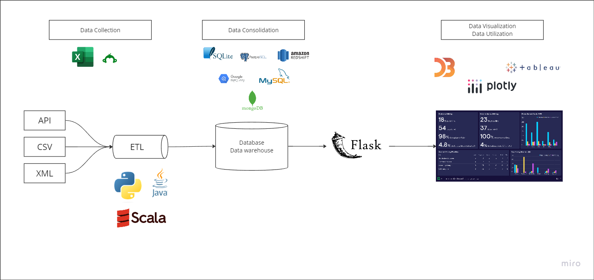

# Sample project for loading data from database into d3

```
.
├── static
|   ├── logic_db.js             # javascript logic for visualizing database data in d3
|   └── logic_mock.js           # javascript logic for visualizing mock data in d3                   
├── templates
|   └── index.html              # html template for d3 visualizations
├── utils  
|   └── database_helper.py      # helper util for reading database
├── app.py                      # flask app to host data endpoints and server
└── README.md
```


